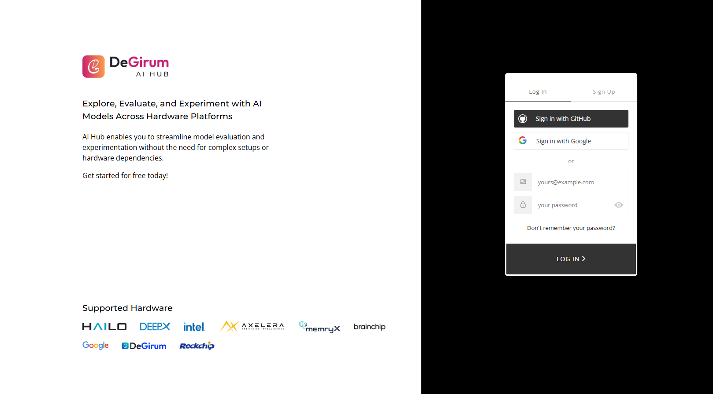
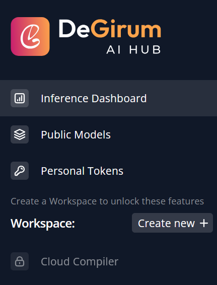
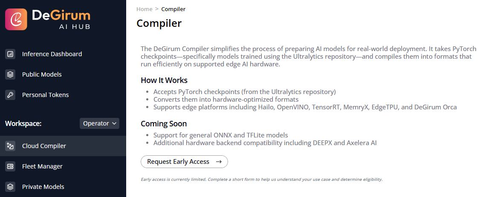
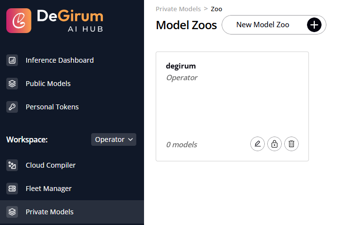
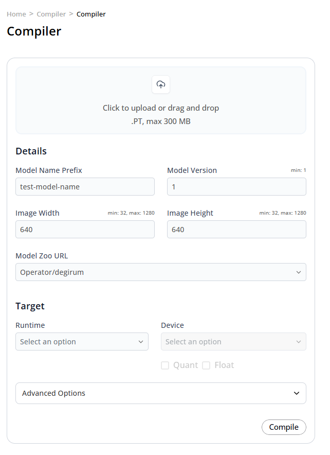
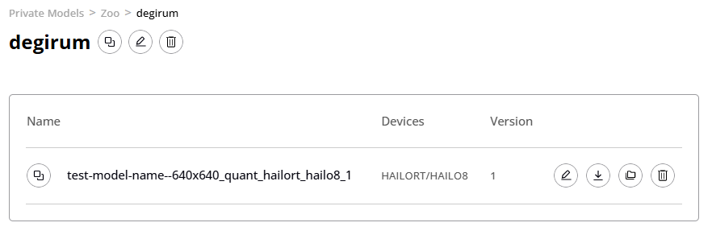
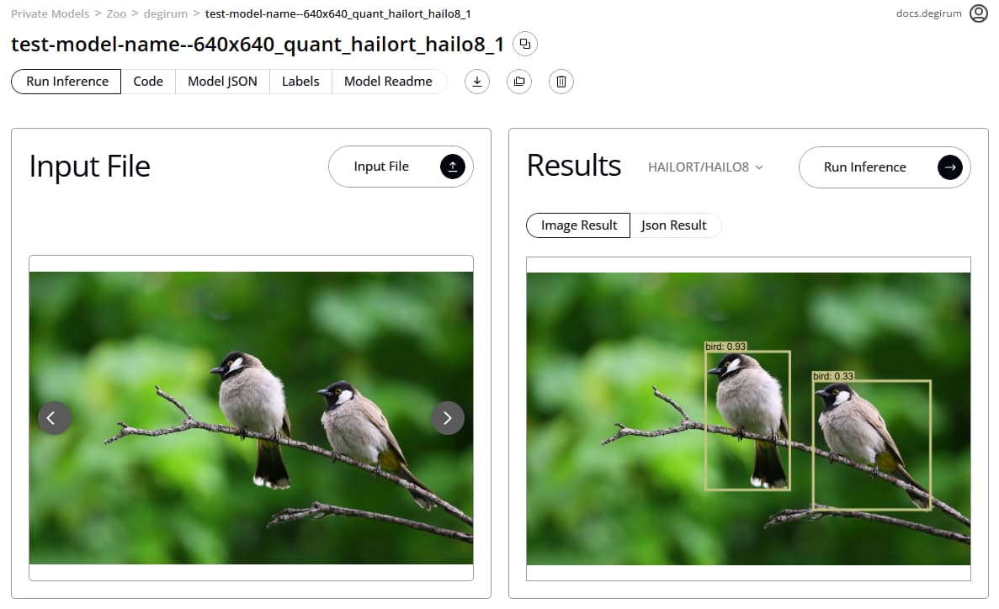

# AI Hub Cloud Compiler Quickstart

_Source: https://community.degirum.com/t/cloud-compiler-quickstart/212_

This guide explains how to request access to the DeGirum Cloud Compiler and retrieve your compiled model.

## Getting to the Cloud Compiler

1. **Sign up for the AI Hub**. Create an account by clicking **Sign Up** on the [AI Hub login page](https://hub.degirum.com). Verify your email address and log in. If you already have an account, just log in.

2. **Create a Workspace**. On the left of the AI Hub, you should see either **Create new** or the name of a Workspace. If you see **Create new**, click the button. If you see a Workspace and you would like models to go into model zoos of a different Workspace, click the name of the Workspace to open a dropdown menu, then click the name of the other Workspace.

3. **Request Cloud Compiler access**. Open the **Cloud Compiler** section below **Workspace** on the left, and submit the early access request form for your Workspace. We review requests actively; you should see a quick turnaround.

4. **Create or get access to a Private Model Zoo**. After we enable the Cloud Compiler for your Workspace, you can create a Model Zoo. The Cloud Compiler will automatically create a model zoo if no other model zoos exist. If you want to customize the Model Zoo where the Cloud Compiler places compiled models, create a Model Zoo. For more detailed instructions about how to create a Model Zoo, [click here](https://docs.degirum.com/).

5. **Visit the Cloud Compiler**. When your Workspace is given access to the Cloud Compiler, visit the Cloud Compiler page again. This time you will see a Cloud Compiler form. Use the form to upload a checkpoint, enter details, select a Model Zoo, and choose a target.

   When you have filled out the form, click **Compile** to create a Cloud Compiler task. When the task is finished, the model will be published to your selected Model Zoo, and you will receive an email from the DeGirum AI Hub.

6. **Locate the compiled model**. Navigate to the Model Zoo selected in the Cloud Compiler form and locate your new model. The model will be named based on what you entered in the Model Cloud Compiler form.

## Using your model after compilation

### Inference Dashboard: Inference without closing your browser tab

You may use your compiled model from the AI Hub with your browser. Locate your model in your Workspace’s Model Zoo and click its name to open the AI Hub’s Inference Dashboard. [Click here](https://docs.degirum.com/) to learn more about the Inference Dashboard.

### PySDK: local hardware, local AI server, or cloud inference

You can use your model with PySDK, a Python library designed to make AI development and deployment simple and efficient. To learn more about PySDK, [click here](https://docs.degirum.com/).

If you would instead like to use your model locally with a local AI hardware accelerator or a local AI server, visit your model in the Model Zoo and download the model.

If you would like to use your model with Cloud Inference, click the **Tokens** button in the AI Hub navigation bar to get an AI Hub access token. You will use this token whenever you connect to the AI Hub to load your model with PySDK. Visit the docs site’s [Quickstart](https://docs.degirum.com/) or [PySDK Usage Examples](https://github.com/DeGirum) to get started with PySDK.
